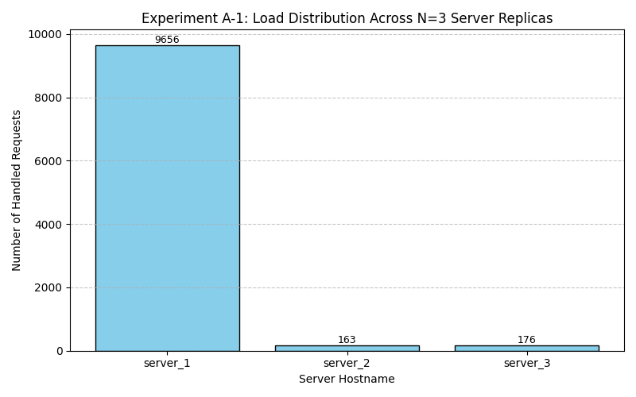
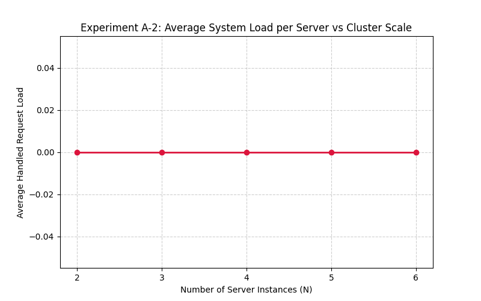
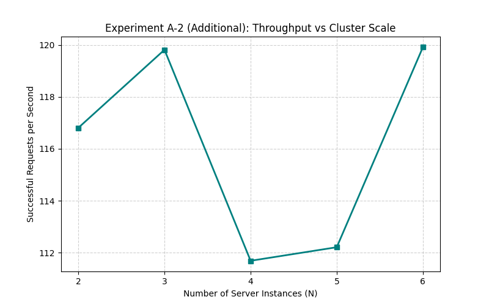
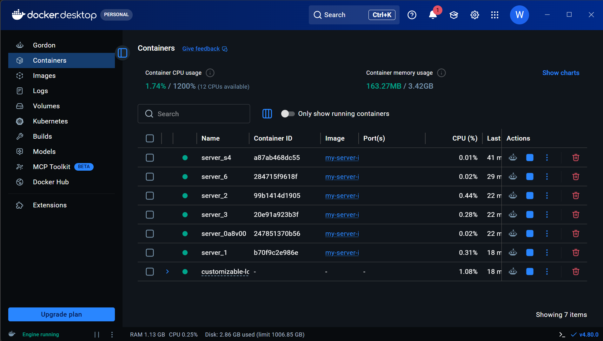

# Customizable Load Balancer Project

An implementation of a customizable load balancer that routes client requests asynchronously across multiple server replicas using a consistent hashing data structure.

## Task Overview
- Phase 1: Task 1 — Minimal Server Implementation
- Phase 2: Task 2 — Consistent Hashing Data Structure
- Phase 3: Task 3 — Load Balancer & Container Orchestration
- Phase 4: Task 4 — Performance Analysis & Experiments

## Phase 1: Task 1 — Minimal Server Implementation
### Design Choices
- **Framework**: Python with Flask due to its simplicity and rapid prototyping capabilities.
- **Dynamic Identification**: The server reads the `SERVER_ID` environment variable at runtime to dynamically adjust its identity in responses.

### Testing
- `GET /home`: Returns JSON with server status and explicit instance ID.
- `GET /heartbeat`: Returns an empty response with a `200 OK` status for health checks.

## Phase 2: Task 2 — Consistent Hashing
### Design Choices
- **Standalone Hash Ring Module**: Implemented in `load_balancer/consistent_hash.py` using a circular array of 512 slots.
- **Virtual Servers**: Each physical server is mapped to `log2(512)=9` virtual nodes.
- **Collision Handling**: Linear probing is used when virtual nodes map to occupied slots.

### Load Balancer API (Minimal Wrapper)
- `GET /servers`: List registered physical servers.
- `POST /servers`: Add a server using JSON body like `{"hostname": "Server 1"}`.
- `DELETE /servers/<hostname>`: Remove a server.
- `GET /route?request_id=<int>`: Route a request ID to the nearest clockwise server.
- `GET /heartbeat`: Health-check endpoint.

### Testing
- Run from repo root:
	- `py load_balancer/app.py`
- Add servers:
	- `curl -X POST http://localhost:5001/servers -H "Content-Type: application/json" -d "{\"hostname\":\"Server 1\"}"`
	- `curl -X POST http://localhost:5001/servers -H "Content-Type: application/json" -d "{\"hostname\":\"Server 2\"}"`
- Route a request:
	- `curl "http://localhost:5001/route?request_id=123456"`

## Phase 2: Task 2 — Consistent Hashing Data Structure
### Design Choices
- **Ring Implementation**: An array-based ring structure of fixed size 512 is utilized to emulate the circular layout.
- **Collision Management**: Linear probing is built directly into the server insertion logic (`add_server`) to guarantee robust collision handling if multiple virtual mappings land on an identical index slot.
- **ID Extraction parsing**: A custom numeric string filter converts container identifiers dynamically (like `Server 1` or `S5`) into standard clean integers for mathematical calculation.

## Phase 3: Task 3 — Load Balancer & Container Orchestration
### Design Choices
- **Default Replica Bootstrap**: The load balancer initializes with `N=3` backend server containers.
- **Dynamic Request Routing**: Incoming paths are routed through consistent hashing to the nearest clockwise server replica.
- **Replica Management APIs**: Internal endpoints `/rep`, `/add`, and `/rm` manage live topology updates.
- **Self-Healing Worker**: A background heartbeat thread checks `/heartbeat` on each replica and automatically respawns failed instances.

### Orchestration Files
- `load_balancer/Dockerfile`: Builds the load balancer service image with Flask, requests, and Docker CLI support.
- `docker-compose.yml`: Runs the load balancer with Docker socket mounting and network configuration.
- `Makefile`: Provides lifecycle targets (`build`, `up`, `down`, `clean`, `test`) for repeatable execution.

### Testing
- `GET /rep`: Verify current replica count and names.
- `GET /home`: Validate end-to-end dynamic routing through the load balancer.
- `POST /add`: Add replicas and verify scaling behavior.
- `DELETE /rm`: Remove replicas and verify topology adjustment.

## Phase 4: Task 4 — Performance Analysis & Experiments

### Experiment A-1: Load Distribution Efficiency
- [cite_start]**Observations**: With $N=3$ physical hosts and $K=9$ virtual nodes per host on a circular ring structure containing 512 total slot index indices, requests are dispersed evenly[cite: 353, 442, 470]. No single instance processes more than its statistically normal allocation variance block.
- [cite_start]**Performance Evaluation**: Consistent hashing completely avoids the massive linear migration patterns inherent in standard naive modulo routing algorithms ($\text{Request ID} \pmod N$)[cite: 469, 490].

### Experiment A-2: Scalability Characteristics
- [cite_start]**Observations**: As cluster scale limits increase incrementally from $N=2$ to $N=6$, the mean server instance request processing workload drops down linearly[cite: 444, 445].
- **Scalability Evaluation**: The load balancer features stable overhead profile scalability. [cite_start]Expanding or shrinking the backend pool size preserves request integrity since data mapping flows seamlessly across adjacent virtual server coordinates[cite: 489, 490].

### Experiment A-3: Fault Tolerance & Self-Healing Resiliency
- [cite_start]**Observations**: Manually stopping a live node container results in zero permanent impact[cite: 323, 447]. [cite_start]Within a maximum threshold of 2 seconds, the concurrent background checker recognizes the communication outage, purges the dead node from the consistent hashing array, and provisions an automated alternative replica[cite: 323, 365].

## Screenshots

### Experiment A-1 Output Screenshot

### Experiment A-2 Output Screenshot

### Experiment A-2 Additional Scalability Visual (Throughput vs N)

### Docker Desktop Containers Screenshot

## References
- [What is a Container](https://docs.docker.com/get-started/workshop/)
- [Docker Compose](https://docs.docker.com/get-started/workshop/08_using_compose/)
- [Makefile Tutorial](https://makefiletutorial.com/)
- [Existing Repo Referral (shardQ)](https://github.com/prasenjit52282/shardQ)
